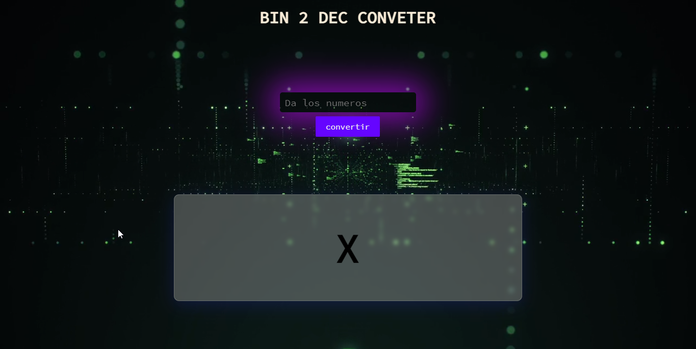

# Binary 2 Decimal App

My first proyect from [Florinpop17´s](https://github.com/florinpop17/app-ideas) repo. Responsive on dev. only works on pc.

## Resources

- [HTML](https://developer.mozilla.org/es/docs/Web/HTML)
- [CSS](https://developer.mozilla.org/es/docs/Web/CSS)
- [JavaScript](https://developer.mozilla.org/es/docs/Web/JavaScript)

## Screenshots

### Social

- [Github](https://github.com/SevroAuBarca)
- [Twitter](https://twitter.com/ZeroTheFasteer)
- [instagram](https://www.instagram.com/daniel.au.lune/)
